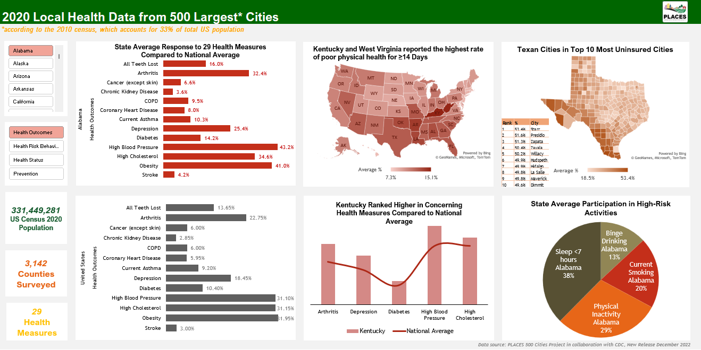

# Hi, I'm Pam Moonthianngam! 👋

## About me
I am an aspiring data analyst with a background in healthcare, specifically in clinical trials and pharmacy

## 🔗 Check me out on LinkedIn

# Project 1: [Excel Dynamic Dashboard](https://github.com/pammoon14/500-Cities-Project)
## Description
This project created an interactive Excel dashboard to visualize and analyze key outcomes of the 2020 local health data from the CDC PLACES 500 Cities Project. This dashboard allows for state and national comparisons of 29 health indicators, including areas in chronic diseases, health risk behaviors, health status, and prevention. 

### Highlighted Skills
**Excel:** data visualization, dashboard design, Pivot Table/Chart, VLOOKUP, XLOOKUP, LARGE

**PowerQuery:** data transformation, data cleaning, filtering

## Data Source
PLACES: Local Data for Better Health, [County Data 2022 release](https://chronicdata.cdc.gov/500-Cities-Places/PLACES-Local-Data-for-Better-Health-County-Data-20/swc5-untb)

## Results 

